# 📰 deepAI Articles

> Auto-synced from Supabase · Updated daily via GitHub Actions

**14 Articles**

---

  <a href='articles/meta-ai-llama-5-replaced-by-muse-spark-a-clear-honest-review.md' style='text-decoration:none;'>
    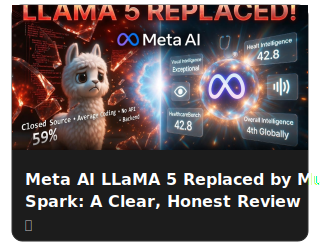
  </a>
  <a href='articles/the-biggest-leak-in-ai-history-anthropics-secret-claude-code-exposed.md' style='text-decoration:none;'>
    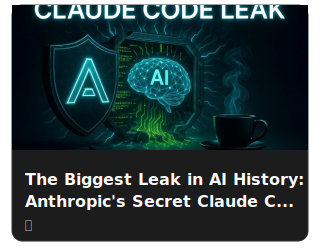
  </a>
  
  <a href='articles/swift-search-agent-i-published-the-code.md' style='text-decoration:none;'>
    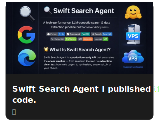
  </a>
  <a href='articles/metas-llama-5-avocado-what-is-really-happening.md' style='text-decoration:none;'>
    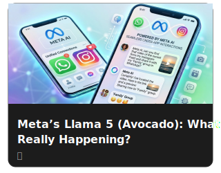
  </a>
  
  <a href='articles/how-to-use-ai-effectively-maximum-output-minimum-cost.md' style='text-decoration:none;'>
    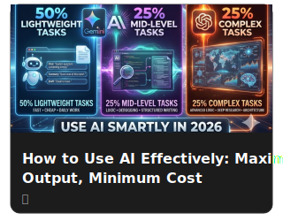
  </a>
  <a href='articles/openai-is-making-the-mistakes-facebook-made-i-quit.md' style='text-decoration:none;'>
    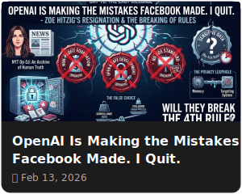
  </a>
  <a href='articles/sarvam-ai-indias-smart-move-in-artificial-intelligence.md' style='text-decoration:none;'>
    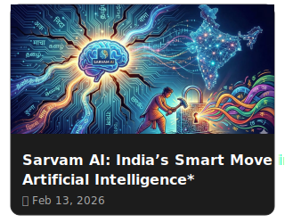
  </a>
  <a href='articles/the-power-of-open-source-communities.md' style='text-decoration:none;'>
    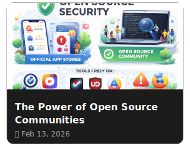
  </a>
  <a href='articles/why-i-am-not-using-clawdbot.md' style='text-decoration:none;'>
    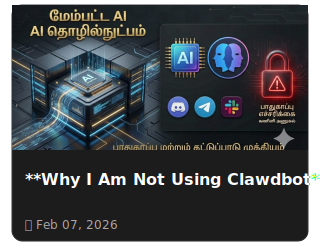
  </a>
  <a href='articles/gpt-53-codex-and-opus-46.md' style='text-decoration:none;'>
    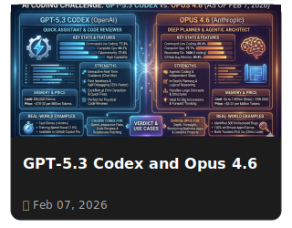
  </a>
  <a href='articles/lm-arena-day-1-experience.md' style='text-decoration:none;'>
    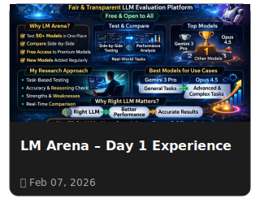
  </a>
  <a href='articles/what-is-google-antigravity-agent-ide.md' style='text-decoration:none;'>
    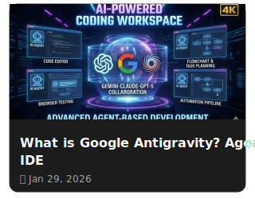
  </a>

---

*[XeL Studio](https://xel-studio.vercel.app) | Auto-generated*